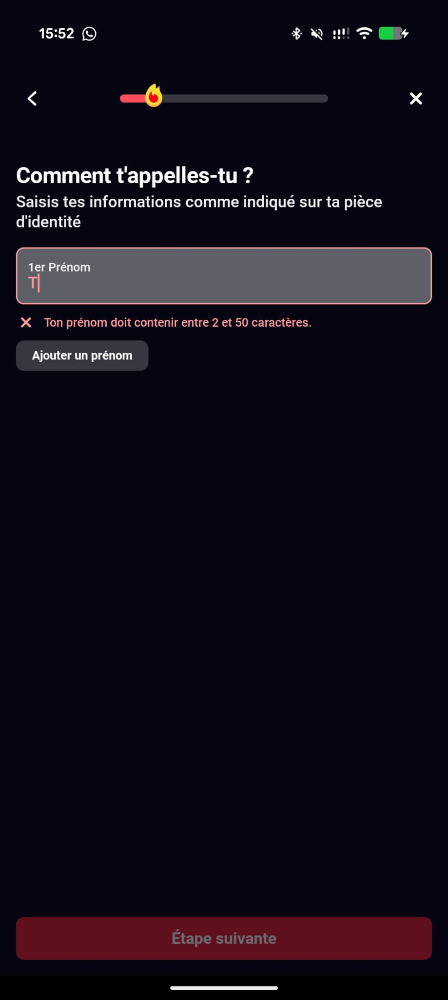
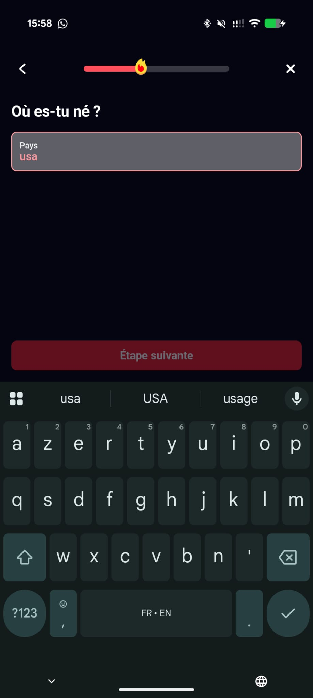
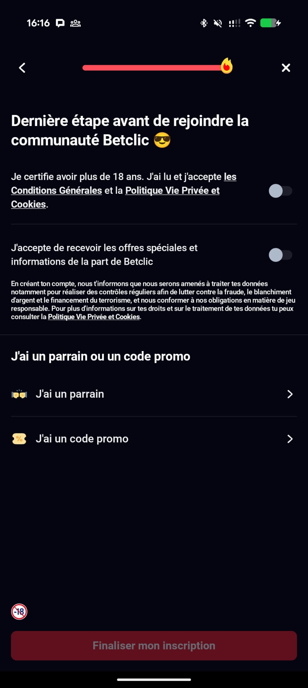
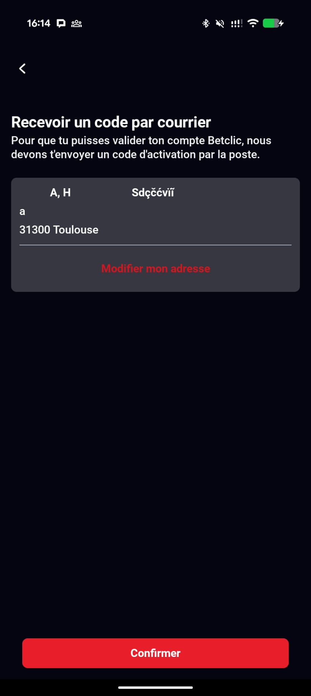

# Betclic Mobile Onboarding — Flow Analysis & UI Review
**Date:** 2026-02-25  
**Scope:** App launch → account registration/onboarding until the last onboarding steps before any deposit.  
**Notes:** I avoided sharing personal data. I skipped the **ID capture** and treated **postal/address verification** as out-of-scope per instructions (when possible).

> **How to view this Markdown with images:** keep the `images/` folder next to this `.md` file (relative paths).

---

## 1) Flow map

### Happy path (observed)
1. **App launch / entry point** → tap **Sign up** (Inscription). *(S3)*
2. **First name** (with option to add an extra first name). *(S5, S9)*
3. **Last name**. *(S13)*

4. **Date of birth** (age gate). *(S21; underage example S20/S22)*
5. **Place of birth**: country + city. *(S23–S27)*
6. **Identity document step** (ID card / passport / driving licence / residence permit) with “Do it later”. *(S28; photo capture flow S31)*
7. **Choose a username/pseudonym** (with availability checks + suggestions). *(S33–S35)*
8. **Create password** (live rule checklist). *(S36–S46)*
9. **Email address** (format validation). *(S47–S48)*
10. **Mobile number** (format validation). *(S49–S50)*
11. **Address details** (required for postal activation flow). *(S51–S55, S53)*
12. **Final confirmations & consents** (age certification + Terms/Privacy/Cookies + optional marketing). Promo/referral optional. *(S56–S61)*
13. **Registration completed** → proceed to additional onboarding prompts (e.g., setting playing limits). *(S62, S64–S68)*

### Alternative branches identified (examples)
- **Age gate**: entering a DOB < 18 shows a hard block message and disables continuing. *(S20, S22)*
- **Validation errors on form fields**:  
  - first name too short *(S5)*  

  - invalid email format *(S47)*  
  - invalid phone number *(S49)*  
  - promo code too long *(S61)*  
- **Pseudonym already taken** → user must choose a different one or pick from suggestions. *(S33)*
- **ID verification**: user can start an ID photo capture flow (ID/passport/etc.) or choose “later”. *(S28, S31)*

### Edge cases worth testing (1–2)
1. **DOB boundary conditions**: user turning 18 today, leap day DOB (29 Feb), and timezone cut-offs.
2. **Password rule persistence**: meet the uppercase requirement, then remove the uppercase and verify the checklist + “Next” state updates correctly (Issue 3).

---

## 2) UI/UX observations (6 issues)

> Each issue includes a screenshot reference and a suggested improvement. (Screenshots are redacted to remove entered dummy details.)

### Issue 1 — Country of birth appears as **free text** and can default to “UNKNOWN”
- **Severity:** High  
- **Evidence:** Country field accepts arbitrary input like “usa” *(S23)* and in another case shows “UNKNOWN” *(S24)*.

- **Why it matters:** Country of birth is a critical KYC attribute. Free-text increases risk of inconsistent data, downstream verification failures, and manual review workload.
- **Suggested improvement:** Replace with **typeahead + controlled list** (ISO country list), prevent “UNKNOWN” as a persisted value, and add clear validation (required, accepted formats).

### Issue 2 — Legal/age confirmation and multiple policies are bundled into **one toggle**
- **Severity:** High  
- **Evidence:** A single toggle covers “I certify I’m over 18” + acceptance of **Terms & Conditions** + **Privacy Policy** + **Cookies** *(S56)*.

- **Why it matters:** In regulated environments, consent/acknowledgement should be **explicit and auditable**. Bundling different legal statements can create compliance concerns and user misunderstanding.
- **Suggested improvement:** Separate into:  
  1) **Age confirmation** (required)  
  2) **T&Cs acceptance** (required)  
  3) **Cookies** (separate consent manager / granular preferences)  
  Privacy policy should be presented as “read/understood” (not necessarily “accept”) depending on the legal basis.

### Issue 3 — Password policy can be **bypassed** (uppercase requirement stays valid after editing)
- **Severity:** High  
- **Evidence:** The checklist shows the **uppercase** requirement as satisfied while the password field contains only lowercase + digit, and “Next” remains enabled *(S46)*.

- **Why it matters:** This creates a **security risk** and can weaken account protection. It also undermines user trust because the UI rules do not match the real validation.
- **Suggested improvement:** Recompute password rules **on every change** from the current string, keep “Next” disabled until all rules truly pass, and ensure server-side validation matches the displayed policy.

### Issue 4 — Identity fields validation is inconsistent and too permissive vs “match your ID”
- **Severity:** Medium  
- **Evidence:** First name shows a strict “2–50 characters” error *(S5)* while other name fields appear less strict. Last name accepts unexpected characters *(S13)* while the copy asks users to enter details “as shown on your ID”.

- **Why it matters:** Inconsistent validation reduces trust and can generate KYC mismatches (manual review / failed checks).
- **Suggested improvement:** Apply a **consistent validation strategy** across all name fields (same rules + same timing), clearly mark optional vs required, and enforce an allowed character set (letters, spaces, hyphens, apostrophes).

### Issue 5 — Phone number step looks **France-only** and the validation message is not informative for international users
- **Severity:** Medium  
- **Evidence:** The step provides no country selector or “+33” hint. Invalid entries show a generic message *(S49)*.

- **Why it matters:** If the product is France-only, this is fine but should be explicit. If international users are expected (or if the app is used by travelers), lack of country code support is a UX friction and can block onboarding.
- **Suggested improvement:** Either (a) explicitly state “French mobile number required” and show an example format, or (b) add a country picker / E.164 formatting with clear validation and error guidance.

### Issue 6 — Postal activation/address verification appears hard to skip (high friction)
- **Severity:** Medium  
- **Evidence:** A step states that a code must be sent **by post** to validate the account *(S53)* and prompts for address details.

- **Why it matters:** This is a significant conversion drop-off risk. If it is mandatory, the app should clearly explain **why** and **when** it’s required (e.g., before withdrawals), and allow deferring where regulation permits.
- **Suggested improvement:** Provide a clear “Do it later” option (if allowed), explain timelines, and provide alternative methods (if any) or a help/support link.

---

## Positive notes (things that look good)
- **Underage protection**: the flow blocks under-18 DOB immediately (good compliance guardrail) *(S20)*.
- **Responsible gaming** onboarding includes defining limits (deposit/stake) *(S64–S68)*.
- **Password UI** provides a clear checklist (good UX), even though the validation state can become inconsistent (see Issue 3).

---

